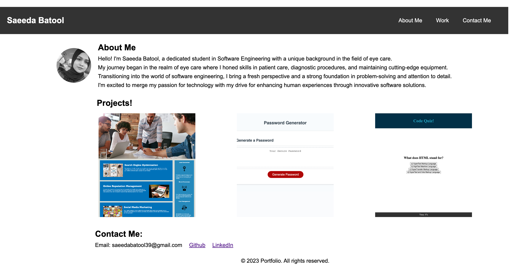

# portfolio

# Description 
A portfolio made using HTML and CSS to allow viewers insights about me and my work. 

## Links

<a href="https://saeeda14.github.io/portfolio/"> Link to Deployed website </a>

<a href="https://github.com/Saeeda14/portfolio.git"> Link to Repo code </a>

## Screenshot

